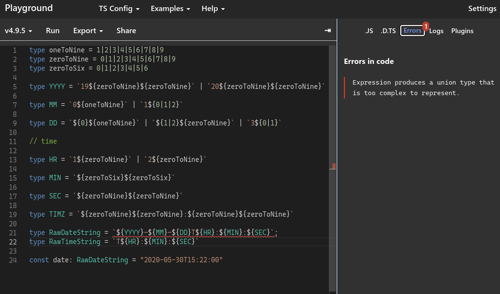
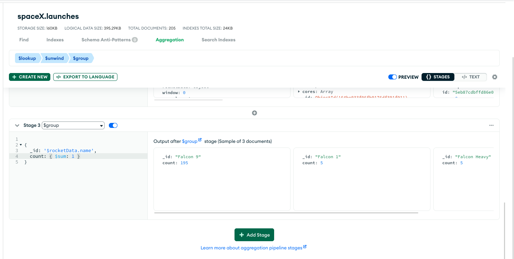

que fique claro, que o typescript não aguentou minha insistência me tipar:

[typescript playground](https://www.typescriptlang.org/play?ts=4.9.5#code/C4TwDgpgBA9gdhAKjAcgSwVAvFAjAHwCZ8BmfAFnwFZ8A2fAdnwA58BOAKFEigC8IATjGTpMOAAz4CxMpRr0mrTt2j8hyAMpoAHtiiTppCtTocu4aAE1rlvQANcbACQBvNcNQYIAX1fuRXt52UPhQdoTifoIeoj5R6p4IQWYqUACyafaRLvBIiT7BoQ6uBkTJ5jwAIpX2Jb45CAFJhWGu0vX++UEhYSQlUuUA9INQwGgAthApFlAAEgBK9rjxMYEt4StNBdM8aQCSKLVu0Zo6HScwWtrlqRoAogDCR52x5wmvdjvQiHtpAFrPC6vTZdABcIOBx3eay+UHmAEMAO6VeHACAaYACDAAcyONks3gAtK4MkTXNVvIhXAtvOCXPsULTXPcHkEANwVaAIxGICbozE4+xUlw0ukMpkuFnlADG8AAzsAoAATVEQUFwpEotEYrFwXE4ABEEQihPEVEJJHEiFwVFBhEIoPE4gNQA)

não tenho certeza como deveria mockar o mongoose (apesar de já ter feito unit tests com typeorm e postgress, nunca fiz com mongodb), mas, achei sobre o mockingoose, aparentemente é o caminho mais facil. 

nunca usei mas muito bom poder usar o atlas para fazer querys

